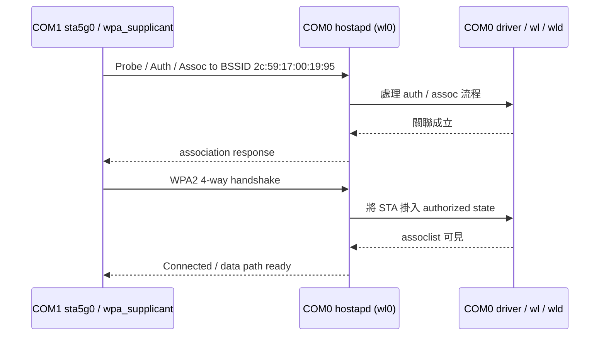

# 5G STA 成功連線經驗紀錄 (`sta5g0` -> DUT `wl0`)

## 一句結論

這次真正成功的案例是 **COM1 臨時 STA `sta5g0` 連上 COM0 的 5 GHz AP `wl0`**。  
這是一個 **non-MLO / WPA2-PSK** 的成功關聯案例，可作為這次 `delegate authentication and association to hostapd` 的 **non-MLO runtime 證據**。

> 注意：
> - 這份紀錄是 **5 GHz 成功案例**。
> - **MLO-specific path 本次沒有驗到**。
> - 驗證完成後，臨時 `sta5g0` / `wpa_supplicant` / 暫存檔已清除，所以這不是「目前仍在線」的狀態，而是「成功經驗記錄」。

---

## 測試目的

驗證 COM0（DUT）上的 hostapd / driver runtime 行為，確認 `delegate authentication and association to hostapd (MLO and non-MLO)` 在實機上是否有作用。

這次成功命中的，是 **non-MLO 5 GHz WPA2-PSK** 路徑。

---

## 測試拓樸

| 角色 | 裝置 | 用途 |
| --- | --- | --- |
| DUT | COM0 | 提供 AP，觀察 hostapd / driver runtime |
| STA | COM1 | 建立暫時 STA，主動連到 DUT |

---

## Factory default 後的 DUT 設定

兩邊 factory default 後重新探測，COM0 上確認到的 AP 佈局如下：

| Band | ifname | SSID | Security | 備註 |
| --- | --- | --- | --- | --- |
| 5 GHz | `wl0` | `OpenWrt_1` | WPA2-PSK | **本次成功連線目標** |
| 6 GHz | `wl1` | `OpenWrt_1` | SAE | 本次未成功完成最終關聯 |
| 2.4 GHz | `wl2` | `OpenWrt_1` | WPA2-PSK | 本次未完成最終成功案例 |

本次 5 GHz 成功案例的關鍵 DUT 參數：

| 項目 | 值 |
| --- | --- |
| DUT AP ifname | `wl0` |
| SSID | `OpenWrt_1` |
| Security | WPA2-PSK |
| Passphrase | `password` |
| BSSID | `2c:59:17:00:19:95` |
| Frequency | 5180 MHz |

6 GHz / 2.4 GHz 也可看到 AP 啟用，但這次真正成功落地的是 5 GHz `wl0`。

---

## 這次為什麼選 5 GHz 做成功驗證

1. Factory default 後，COM1 預設也回到 AP 模式，沒有可直接重用的 built-in STA / supplicant 流程。
2. 因此改成在 COM1 上建立 **臨時 managed STA 介面**。
3. 2.4 / 5 / 6 三個 band 都嘗試過掃描，但有一個重要觀察：
   - **掃描結果不一定看得到 COM0 的 BSSID**
   - 但這不代表實際不能連
4. 最終採用 **已知 BSSID + 已知頻道的 5 GHz 強制關聯方式**，成功率最高，也確實成功。

---

## serialwrap 操作原則

這次實作上有一個很重要的經驗：

- **不要把很長的 shell command 一次送進 UART**
- **不要假設 multiline command 一定能完整保留**
- 對 COM1 / COM0 的 target shell 操作，應改成 **多條短命令** 分次送

因此以下記錄中的 target-side command，實際執行時都是透過 `serialwrap cmd submit` 一條一條送入。

CLI wrapper 形式如下：

```bash
serialwrap cmd submit \
  --selector COM1 \
  --cmd '<target-cmd>' \
  --source agent:copilot-cli \
  --mode line \
  --cmd-timeout 15
```

對 COM0 也是相同模式，只是 `--selector COM0`。

---

## Session readiness 檢查

先確保 COM0 / COM1 session 可用：

```bash
serialwrap session self-test --selector COM0
serialwrap session self-test --selector COM1
```

若 session 因 prompt state 不乾淨或 interactive 影響而不穩，先 recover：

```bash
serialwrap session recover --selector COM0
serialwrap session recover --selector COM1
```

這次 workflow 中，`recover` 對重新拉回 `READY` 是有幫助的。

---

## DUT 端事前確認

### 1. 確認 hostapd 狀態

在 COM0 上確認：

```bash
hostapd_cli -i wl0 status
hostapd_cli -i wl1 status
hostapd_cli -i wl2 status
```

這次看到三個 radio 都是 `state=ENABLED`。

### 2. 確認 runtime security config

在 COM0 上讀 runtime hostapd config：

```bash
cat /tmp/wl0_hapd.conf
cat /tmp/wl1_hapd.conf
cat /tmp/wl2_hapd.conf
```

這次讀到的關鍵值如下：

```text
/tmp/wl0_hapd.conf -> wpa_passphrase=password
/tmp/wl1_hapd.conf -> sae_password=password, wpa_passphrase=password
/tmp/wl2_hapd.conf -> wpa_passphrase=password
```

因此本次 5 GHz 成功路徑使用：

- `SSID=OpenWrt_1`
- `PSK=password`
- `BSSID=2c:59:17:00:19:95`
- `band=5 GHz`

---

## COM1 建立臨時 5 GHz STA (`sta5g0`)

### 1. 建立介面

在 COM1 上建立 5 GHz 臨時 STA：

```bash
iw phy phy0 interface add sta5g0 type managed
ip link set sta5g0 up
```

> 這裡使用的 `phy0` 對應到 5 GHz 路徑。

### 2. 準備 `wpa_supplicant` 設定

因為長命令容易被 UART 截斷，所以實際上是用多條短 `echo >>` 指令逐行組出設定檔。  
這次生效的設定內容可整理為：

```conf
ctrl_interface=/var/run/wpa_supplicant
update_config=1

network={
    ssid="OpenWrt_1"
    psk="password"
    key_mgmt=WPA-PSK
    bssid=2c:59:17:00:19:95
    scan_ssid=1
    freq_list=5180
}
```

### 3. 啟動 supplicant

```bash
wpa_supplicant -B -i sta5g0 -c /tmp/sta5g0.conf -P /tmp/sta5g0.pid -f /tmp/sta5g0.log
```

### 4. STA 側立即確認

```bash
wpa_cli -i sta5g0 status
iw dev sta5g0 link
tail -n 100 /tmp/sta5g0.log
```

這次成功時，COM1 看到的關鍵結果是：

```text
wpa_state=COMPLETED
```

以及：

```text
Connected to 2c:59:17:00:19:95
SSID: OpenWrt_1
freq: 5180
```

`/tmp/sta5g0.log` 中則可看到完整 4-way handshake 完成與 `CTRL-EVENT-CONNECTED`。

---

## DUT 側 runtime 驗證命令

COM1 成功連線後，立即在 COM0 上取證：

```bash
hostapd_cli -i wl0 all_sta
wl -i wl0 assoclist
logread | grep -E 'associated|pairwise key handshake completed|Connect'
```

這次成功案例的 DUT 端證據如下。

### 1. `hostapd_cli -i wl0 all_sta`

看到 STA `2e:59:17:00:04:85`，而且 flags 包含：

```text
[AUTH][ASSOC][AUTHORIZED][WMM][HT]
```

這表示 hostapd 視角下，該 STA 已完成：

- authentication
- association
- authorization

### 2. `wl -i wl0 assoclist`

driver 視角也能看到同一個 STA 已在 association list 中。

### 3. `logread`

成功案例中，COM0 上抓到的代表性 log 有：

```text
wl0: STA 2e:59:17:00:04:85 IEEE 802.11: associated (aid 1)
wl0: STA 2e:59:17:00:04:85 WPA: pairwise key handshake completed (RSN)
wld: ... Connect 2E:59:17:00:04:85
```

---

## Trace flow（根據 runtime 證據重建）

> 這是依照成功當下的 `wpa_supplicant` / `hostapd_cli all_sta` / `wl assoclist` / `logread` 證據重建的邏輯流程，不是空口 sniffer 封包圖。



---

## 為什麼這可以當作 non-MLO runtime 證據

你前面給的判讀原則有一個很重要的 fallback：

> 如果驗的是 non-MLO WPA2-PSK / FT，沒有看到特定字串也不一定代表沒打到；  
> 這時以 client 能穩定連上，且 `hostapd_cli all_sta` 與 `wl assoclist` 都同時看到 STA，作為主要 runtime 證據。

這次 5 GHz 成功案例完全符合這個判讀條件：

1. STA 端 `wpa_state=COMPLETED`
2. `iw dev sta5g0 link` 確認已連到 DUT `wl0`
3. DUT `hostapd_cli -i wl0 all_sta` 看得到 STA，且有 `[AUTH][ASSOC][AUTHORIZED]`
4. DUT `wl -i wl0 assoclist` 同時也看得到 STA
5. DUT `logread` 有關聯與 RSN 4-way handshake 完成紀錄

因此，這次可以合理收斂為：

- **non-MLO hostapd delegation path：確認成立**

---

## 這次沒有看到的字串

這輪 **沒有** 在成功案例中看到以下 0006 marker：

- `Drop AUTH received from Host driver`
- `hostapd assoc_rsp accepted, creating final MLO assoc_resp`
- `skip dup Open System MLC_AUTH_SYNC_RESP`

因此本次結論必須明確區分：

| 項目 | 結論 |
| --- | --- |
| non-MLO 5 GHz path | **已確認成功** |
| explicit 0006 marker string 命中 | **未看到** |
| MLO-specific path | **尚未驗證** |

---

## 這次 workflow 中很重要的實戰經驗

### 1. 掃描看不到 AP，不代表不能連

這次一個很有用的觀察是：

- COM1 臨時 STA 掃描時，不一定能在 scan result 中看到 COM0 的 BSSID
- 但只要已知：
  - SSID
  - BSSID
  - band / frequency
- 仍然可能透過強制關聯方式成功連上

對這類平台來說，scan visibility 不能直接當作 connectivity 的唯一判準。

### 2. 長命令要拆

這次多次遇到 UART / shell 命令被截斷，因此實務上要遵守：

- 每條指令盡量短
- 避免 multiline shell command
- 設定檔用多條短 `echo >> file` 組出
- 不要把整段配置 / 啟動 / 驗證一次塞成單條命令

### 3. background log capture 的可觀察性目前不夠穩

這次也觀察到：

- background command 執行時，`cmd status` / `result-tail` 的語義不夠清楚
- 因此對背景 log capture 不宜過度依賴單一 polling 行為

這點已另外整理成 serialwrap issue：

- `#28 Bug: background cmd 在執行中時 status/result-tail 語義不清楚`

---

## 可直接複製的成功驗證流程

若要重跑這次成功案例，可依以下節奏執行：

1. COM0 / COM1 先 `session self-test`
2. 如有需要先 `session recover`
3. 在 COM0 確認：
   - `wl0` 已 `state=ENABLED`
   - `/tmp/wl0_hapd.conf` 仍是 `wpa_passphrase=password`
4. 在 COM1：
   - 建 `sta5g0`
   - 用短命令組出 `/tmp/sta5g0.conf`
   - 啟動 `wpa_supplicant`
5. STA 端確認：
   - `wpa_cli -i sta5g0 status`
   - `iw dev sta5g0 link`
6. DUT 端立即取證：
   - `hostapd_cli -i wl0 all_sta`
   - `wl -i wl0 assoclist`
   - `logread | grep ...`
7. 驗證完成後清掉：
   - `/tmp/sta5g0.conf`
   - `/tmp/sta5g0.pid`
   - `/tmp/sta5g0.log`
   - `sta5g0`

---

## 清理方式

驗證完成後，在 COM1 做清理：

```bash
kill "$(cat /tmp/sta5g0.pid)" 2>/dev/null
rm -f /tmp/sta5g0.conf /tmp/sta5g0.pid /tmp/sta5g0.log
iw dev sta5g0 del
```

---

## 最終結論

這次 `sta5g0` 成功連線案例可以作為以下結論的依據：

- **COM1 -> COM0 的 5 GHz (`sta5g0` -> `wl0`) 關聯成功**
- **這是 non-MLO WPA2-PSK 成功案例**
- **hostapd 在 non-MLO auth/assoc path 上確實有作用**
- **MLO-specific 路徑仍需另外驗證**
