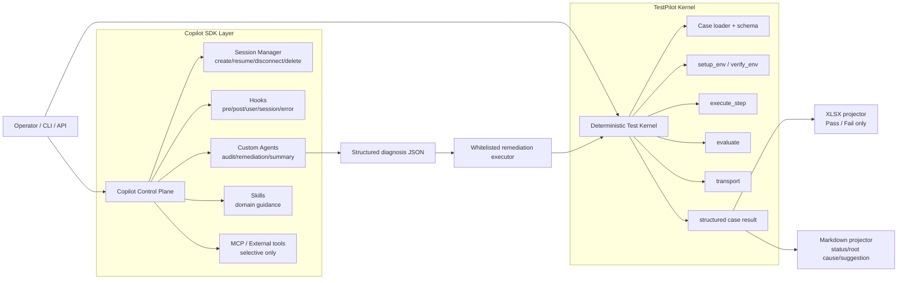

# TestPilot Third Refactor Research: Copilot SDK as the control plane, deterministic kernel as the verdict plane

## Executive summary

The best-fit third refactor is **not** a full agent-first rewrite where YAML becomes the main prompt and the agent decides test execution ad hoc. It is a **hybrid architecture**:

- keep the current deterministic execution kernel for `setup_env -> verify_env -> execute_step -> evaluate -> report projection`
- move agent/runtime concerns onto **GitHub Copilot SDK**
- use **hooks, custom agents, skills, session persistence, and selective MCP** to reduce homegrown orchestration code
- keep **final pass/fail** outside the conversational path

This direction is consistent with the earlier architecture research: TestPilot already fits best as a **deterministic, domain-specific test kernel**, not as a generic persistent agent platform.[^1][^2][^3]

For your stated goal — **maximize source-code reduction, but keep results controllable and non-drifting** — the winning option is:

> **Copilot SDK-led control plane + deterministic test kernel.**

It gives most of the code-reduction upside of an SDK-first architecture, while preserving the repo's strongest anti-drift properties: YAML-driven cases, serialized execution, retry-aware timeouts, alignment gating, per-case trace artifacts, and plugin-owned pass/fail evaluation.[^4][^5][^6]

## 1. What the repo is today

The repo still presents itself as a plugin-based embedded-device test framework built around `Orchestrator -> Plugin -> YAML Cases`, with `wifi_llapi` as the most complete production path.[^4]

The architecture spec says the core stack is:

- `Orchestrator` for run coordination
- `PluginLoader` for plugin discovery
- `AgentRuntime` for runner selection and trace
- `TestbedConfig` + schema validation
- `wifi_llapi/plugin.py` for `setup_env / verify_env / execute_step / evaluate`
- transport adapters for serial/adb/ssh/network
- Excel delivery with Markdown/JSON analysis planned as a second reporting track[^5]

At the same time, the spec openly calls out the current pain points:

- `Orchestrator` is a god class
- `wifi_llapi` is hard-coded in the orchestrator path
- report handling and plugin boundaries are still uneven
- the intended R4 direction is Copilot SDK, but after core cleanup stages[^6]

That matters, because the third refactor should **remove bespoke agent plumbing**, not replace the stable parts of the execution path.

## 2. What is already deterministic and worth keeping

The current `wifi_llapi` path is much more deterministic than an “agent runtime” reading would suggest.

### 2.1 Runner selection is metadata-first today

`agent_runtime.py` selects a runner by priority and availability, recording a structured trace rather than running a conversational loop in the hot path.[^7] The orchestrator then records fallback reasons and selected runner into `selection_trace`.[^8]

### 2.2 The hot verdict path is still plugin-owned

Inside `_execute_wifi_llapi_case_once()`, the orchestrator directly calls:

- `plugin.setup_env()`
- `plugin.verify_env()`
- `plugin.execute_step()`
- `plugin.evaluate()`
- `plugin.teardown()`

and only then returns `verdict/comment/commands/outputs`.[^9]

That is exactly the seam you want to preserve.

### 2.3 Retry, timeout, and trace are explicit

The orchestrator computes timeout from `base_seconds + per_step_seconds * steps_count`, multiplied per retry attempt and capped by `max_seconds`.[^10] It also writes per-case trace JSON with:

- execution policy
- runner selection trace
- per-attempt commands/outputs/comments/timeouts
- final status and attempts used[^11]

Those artifacts are the foundation for stable results, reproducibility, and post-failure diagnosis.

### 2.4 Drift still exists in the plugin execution path

The biggest remaining drift vector is `wifi_llapi/plugin.py`. `execute_step()` can:

- synthesize a capture query
- extract executable fragments from step text
- sanitize free-form command fragments
- fall back to alternate commands when the first result looks unexecutable[^12]

`evaluate()` is deterministic once given data, but `execute_step()` still contains wording-sensitive heuristic behavior.[^12]

So the third refactor should not make the runtime *more* prompt-interpreted than it already is.

## 3. What Copilot SDK can replace directly

Official Copilot SDK docs and Python source show that the SDK already has native support for the exact control-plane primitives TestPilot would otherwise have to keep building itself.

### 3.1 Session lifecycle and persistence

The Python SDK exposes:

- `create_session()`
- `resume_session()`
- `list_sessions()`
- `delete_session()`
- `list_models()`[^13]

Session config and resume config support:

- `session_id`
- `working_directory`
- `config_dir`
- `streaming`
- `available_tools` / `excluded_tools`
- `hooks`
- `mcp_servers`
- `custom_agents`
- `agent`
- `skill_directories` / `disabled_skills`
- `infinite_sessions`[^14]

`CopilotSession.workspace_path` explicitly represents a persisted workspace directory, and `disconnect()` preserves state for later `resume_session()`, while `delete_session()` permanently removes it.[^15][^16]

**Conclusion:** TestPilot does not need to build its own long-lived agent session store, compaction logic, or resume/delete lifecycle if it adopts Copilot SDK as the agent runtime plane.

### 3.2 Hooks

The SDK provides hook types for:

- `on_pre_tool_use`
- `on_post_tool_use`
- `on_user_prompt_submitted`
- `on_session_start`
- `on_session_end`
- `on_error_occurred`[^14]

Hook output types are powerful enough to implement the exact guardrails TestPilot needs:

- pre-tool: `permissionDecision`, `modifiedArgs`, `additionalContext`, `suppressOutput`
- post-tool: `modifiedResult`, `additionalContext`, `suppressOutput`
- user-prompt: `modifiedPrompt`, `additionalContext`
- session-start: `additionalContext`, `modifiedConfig`
- error: `errorHandling` = `retry | skip | abort`[^17]

The official hook guide also describes the hooks as the place to implement permission control, prompt filtering, auditing, notifications, and session policy without modifying core agent behavior.[^18]

**Conclusion:** TestPilot does not need a bespoke “agent policy middleware” once it moves onto Copilot SDK hooks.

### 3.3 Custom agents / sub-agents

Official docs show that custom agents can be attached to a session with:

- `name`
- `description`
- `prompt`
- optional scoped `tools`
- optional per-agent `mcpServers`
- optional `infer` flag for runtime auto-selection[^14][^19]

The runtime can auto-select sub-agents based on intent, run them in isolated contexts, and emit lifecycle events such as:

- `subagent.selected`
- `subagent.started`
- `subagent.completed`
- `subagent.failed`
- `subagent.deselected`[^20]

**Conclusion:** TestPilot does not need to hand-roll sub-agent routing and event wiring for audit/remediation/report-summary roles.

### 3.4 Skills

The SDK supports `skill_directories` and `disabled_skills` at both create and resume time, and the Python client serializes those fields directly into the wire payload.[^14][^21]

**Conclusion:** domain guidance such as `wifi_llapi` diagnosis rules, report-writing conventions, and remediation policy can move into reusable skill modules instead of being duplicated in prompts or code comments.

### 3.5 MCP

The SDK types and create/resume payloads explicitly support per-session `mcp_servers`, including local/stdin-stdout and remote HTTP/SSE configuration.[^14][^21]

**Conclusion:** if TestPilot needs shared external tools later, the SDK already supports the protocol boundary. TestPilot does not need to invent one first.

## 4. What Copilot SDK should **not** replace

This is the most important architectural boundary.

Copilot SDK should **not** become the canonical verdict generator.

Specifically, do **not** move these responsibilities into prompt interpretation:

- YAML case semantics
- environment gate semantics
- transport command execution
- pass criteria comparison
- report row alignment
- final xlsx pass/fail projection

Those responsibilities already live in the deterministic kernel and are the reason the system is currently more stable than a naïve “agent-first” design.[^5][^9][^10][^11][^12]

In other words:

- **Copilot SDK should own the control plane.**
- **TestPilot kernel should own the verdict plane.**

That split is also consistent with the earlier research conclusion: keep agent/LLM logic out of the hot verdict path until the deterministic kernel is complete.[^1][^2][^3]

## 5. Why “YAML as prompt” is still the wrong center of gravity

If YAML is treated mainly as prompt material for an agent, you lose the strongest anti-drift property in the current repo: **explicit executable semantics**.

Today, the repo already encodes execution policy in code and config:

- sequential single-case scheduling
- capped retry-aware timeout
- per-case trace persistence
- explicit `Pass/Fail` recording
- plugin-owned `evaluate()`[^8][^9][^10][^11][^13]

If you convert YAML into the main execution prompt, these become model-mediated behaviors rather than fixed behaviors.

That may reduce visible source code, but it does **not** reduce system complexity when your real goal is controllable test results. It only shifts complexity from code into prompt interpretation, hook policy, and post-hoc debugging.

So the correct use of YAML remains:

> **YAML as executable spec, not YAML as agent prompt.**

## 6. Recommended third-refactor architecture



### 6.1 Control-plane responsibilities (Copilot SDK)

Copilot SDK should own:

- session creation/resume/delete
- operator chat UX
- per-case advisory audit
- remediation planning
- report summarization
- policy hooks / tool gating
- reusable skills
- optional external integrations via MCP

### 6.2 Verdict-plane responsibilities (TestPilot kernel)

The deterministic kernel should keep owning:

- case discovery/filtering
- source-row alignment gating
- environment setup/verification
- actual transport execution
- pass criteria evaluation
- retry/timeout policy
- structured evidence generation
- xlsx pass/fail projection

## 7. Recommended Copilot agent roles

The current repo and SDK capabilities point to four practical Copilot roles.

### 7.1 `operator`

Purpose:

- human-facing natural-language layer
- explain current run/case state
- resume interrupted work
- answer “what happened?” questions

Default tools:

- read-only tools only
- trace readers
- result readers
- report generators

No shell, no raw DUT mutation.

### 7.2 `case-auditor`

Purpose:

- consume structured case trace and structured evidence
- classify likely failure class
- produce root cause and suggestion
- write md diagnostics

Default tools:

- read-only trace/result tools
- optional knowledge MCP / docs lookup

This agent should usually be `infer: true` because it is low risk and high value.[^19][^20]

### 7.3 `remediation-planner`

Purpose:

- only after a deterministic failure is already recorded
- decide whether failure looks like `environment/config/dependency` rather than product behavior
- output a **structured remediation plan JSON**

This agent should usually be `infer: false` and be invoked only by policy after failure classification, because it can trigger lab changes.[^19][^20]

### 7.4 `run-summarizer`

Purpose:

- aggregate completed case results
- generate md summary with root-cause buckets, remediation history, suggestions, and notable anomalies

No authority over final xlsx verdict.

## 8. Hook design for controllability

The hook model fits TestPilot's needs unusually well.

### 8.1 `on_session_start`

Use it to inject:

- testbed name
- plugin name
- run ID
- case ID
- source row
- current retry attempt
- selected model order
- prior deterministic evidence location[^17]

That keeps prompts thin while still making sessions auditable.

### 8.2 `on_pre_tool_use`

This is the main stability control point.

Use it to:

- allow only approved tool sets per agent
- deny generic shell / bash by default
- stamp case/run metadata into tool args
- force safe directories via `working_directory`
- prevent agents from editing canonical evidence files[^17][^18]

### 8.3 `on_post_tool_use`

Use it to:

- redact secrets
- truncate noisy logs
- turn raw results into summarized diagnostics
- append explicit cautionary context when a tool failed[^17][^18]

### 8.4 `on_user_prompt_submitted`

Use it sparingly.

It is useful for:

- normalizing operator phrases into explicit intents
- mapping “rerun D271 with env fix” into structured control prompts

It should **not** rewrite YAML semantics or silently reinterpret formal test cases.[^17]

### 8.5 `on_error_occurred`

Use it only for advisory/session errors, not verdict errors.

Good uses:

- retrying transient model/tool faults for summary/audit sessions
- skipping a failed diagnosis step while preserving deterministic case result
- surfacing user notifications for manual follow-up[^17]

## 9. Session and persistence design

The SDK session model is strong enough to support resumable lab workflows.[^13][^14][^15][^16]

### 9.1 Session ID strategy

Recommended naming:

- run session: `run-{run_id}`
- case audit session: `run-{run_id}-case-{case_id}`
- remediation session: `run-{run_id}-case-{case_id}-remediate-{attempt}`

Why this matters:

- easy resume after interruption
- simple operator audit trail
- straightforward cleanup policy
- natural mapping to report artifacts

### 9.2 What should live in SDK session state vs. deterministic artifacts

**SDK session state should hold:**

- conversational context
- agent summaries
- operator interactions
- generated notes / md draft content
- skill-influenced advisory context

**Deterministic artifacts should remain canonical:**

- case trace JSON
- execution policy
- selected runner/model
- actual commands executed
- raw outputs used for evaluation
- final pass/fail verdict

That way, session loss affects convenience, not truth.

### 9.3 Lifecycle policy

- create session when a run starts
- disconnect when a case/run is finished but may need resume
- delete sessions once md/xlsx artifacts and summaries are finalized[^15][^16]

## 10. Skills design

Skills are the right place for stable domain guidance that should be reused across agents but should not sit inside every prompt.[^14][^21]

Recommended initial skill set:

### 10.1 `wifi-llapi-diagnostics`

Contains:

- how to interpret common `wifi_llapi` failure patterns
- distinction between DUT defect vs environment/config dependency
- “never override deterministic verdict” rule

### 10.2 `env-remediation-policy`

Contains:

- remediation eligibility rules
- what counts as safe environment/config repair
- mandatory evidence requirements before retry
- when to stop and mark `Inconclusive` or `FailEnv`

### 10.3 `report-style`

Contains:

- md report layout
- root-cause taxonomy
- concise suggestion format
- wording discipline so summary quality is stable across runs

## 11. MCP recommendation: selective, not foundational

Copilot SDK supports MCP cleanly, but MCP should be used where it genuinely reduces code, not where it adds runtime variability.[^14][^21]

### 11.1 Use SDK custom tools first for existing Python kernel code

For current TestPilot internals, the lowest-code path is usually:

- expose existing Python functions as SDK custom tools
- keep them in-process
- keep tool schemas narrow and structured

Good candidates:

- `load_case_result(case_id)`
- `read_case_trace(case_id)`
- `classify_failure(evidence)`
- `apply_remediation(action_json)`
- `rerun_case(case_id, mode)`
- `render_md_report(run_id)`

### 11.2 Use MCP for shared external systems

Good MCP candidates later:

- GitHub repo/issues/artifacts
- shared knowledge base
- lab inventory / reservation service
- artifact registry or dashboard backends

### 11.3 Do **not** make generic MCP shell the main DUT execution path

That would widen the execution surface and reduce predictability. The hot path should still go through the kernel's transport and plugin code.

## 12. Reporting model: exactly how to avoid drift

Your reporting split is the correct one.

### 12.1 Canonical result object

Introduce or formalize one canonical structured result per case:

```json
{
  "run_id": "20250301T101500",
  "case_id": "D271",
  "final_verdict": "Pass",
  "diagnostic_status": "PassAfterRemediation",
  "root_cause": "STA config missing before retry",
  "suggestions": ["preflight check STA profile before case start"],
  "selection_trace": {"model": "gpt-5.4", "agent": "case-auditor"},
  "attempts": [],
  "evidence_refs": []
}
```

### 12.2 Projection rules

**XLSX** should only contain:

- `Pass`
- `Fail`

**Markdown report** should contain:

- `Pass`
- `PassAfterRemediation`
- `FailEnv`
- `FailConfig`
- `FailTest`
- `Inconclusive`
- root cause
- suggestion
- remediation history
- model/session trace

This preserves delivery simplicity while keeping diagnostics rich.

### 12.3 Verdict authority

The rule should be explicit:

- `final_verdict` comes from deterministic kernel evaluation and rerun outcome
- md-only statuses may use Copilot-assisted diagnosis
- Copilot never overwrites the kernel's raw evidence[^9][^11][^12]

## 13. Source-code reduction: where you actually save code

If the third refactor is done correctly, Copilot SDK can remove or sharply shrink a lot of glue code.

### 13.1 Code you can avoid building or gradually retire

- bespoke session persistence / resume manager
- bespoke sub-agent orchestration layer
- bespoke hook/policy middleware
- bespoke skill loader
- bespoke MCP client plumbing
- large parts of custom agent runtime metadata wiring

### 13.2 Code you still need

- transport implementations
- plugin kernel (`setup_env/verify_env/execute_step/evaluate`)
- alignment gating
- structured evidence generation
- remediation whitelist executor
- xlsx/md projectors

This is the key tradeoff:

> **Copilot SDK reduces control-plane code, not kernel code.**

That is still a big win, and it is the *right* kind of win for your reliability goal.

## 14. Option comparison

| Option | What it means | Result controllability | Source-code reduction | Fit to current repo | Risk | Verdict |
|---|---|---:|---:|---:|---:|---|
| A. Minimal sidecar | Keep current design; add Copilot only for summaries | 5/5 | 2/5 | 4/5 | 2/5 | Safe, but underuses SDK |
| B. Full agent-first | YAML becomes main prompt; agent drives commands/verdicts | 1/5 | 5/5 | 2/5 | 5/5 | Wrong fit for non-drifting results |
| C. SDK control plane + deterministic kernel | SDK owns sessions/hooks/agents/skills; kernel owns execution/verdict | 5/5 | 4/5 | 5/5 | 3/5 | **Best overall choice** |

Option C is the only choice that satisfies both of your constraints simultaneously:

- **reduce source code materially**
- **keep test results controllable**

## 15. Migration implications for current policy

There is a direct policy mismatch between the current repo and your intended direction.

Current repo policy and `wifi_llapi/agent-config.yaml` still say:

- Priority 1: `codex + gpt-5.3-codex + high`
- Priority 2: `copilot + sonnet-4.6 + high`
- case-level execution
- sequential scheduling
- retry-then-fail-and-continue[^13]

Your latest discussion target is:

- primary: `gpt-5.4`
- fallback: `sonnet-4.6`
- second fallback: `gpt-5-mini`[^22]

My recommendation is:

- preserve **execution policy** semantics (case-level, sequential, retry, timeout growth)
- preserve **selection trace** artifact semantics
- migrate **model priority** semantics onto Copilot SDK session/custom-agent config
- stop modeling “codex vs copilot” as two different external execution planes

That is an architectural simplification, not just a model swap.

## 16. Phased rollout recommendation

### Phase 1: Adopt Copilot SDK as an advisory sidecar

Implement first:

- thin Python SDK adapter
- session create/resume/delete/list
- run/operator session IDs
- read-only `operator` + `case-auditor` agents
- md summary generation only

No remediation yet. No kernel ownership changes.

### Phase 2: Add hook-governed tool control

Implement:

- strict `available_tools` / `excluded_tools`
- `on_pre_tool_use` deny-by-default for risky tools
- `on_post_tool_use` redaction/summarization
- `on_session_start` context injection

This is where most control-plane code reduction begins.

### Phase 3: Add deterministic remediation loop

Implement:

- `remediation-planner` agent
- structured remediation JSON output
- whitelisted remediation executor
- deterministic re-verify and rerun
- md-only diagnostic statuses

Still no agent-owned verdict.

### Phase 4: Add selective MCP

Only after the above is stable:

- GitHub/reporting/inventory integrations
- optional read-mostly external knowledge tools

Keep MCP off the hot DUT verdict path.

### Phase 5: Simplify legacy agent runtime code

After the SDK path proves stable:

- retire or shrink the current custom runner-selection glue
- preserve historical `selection_trace` compatibility
- keep kernel/report invariants intact

## 17. Final recommendation

If the question is:

> “Can the third refactor be centered on Copilot SDK, while maximizing hooks/skills/session resume/persistence/custom-agents/MCP, reducing source code, and still keeping test results from drifting?”

The answer is:

> **Yes — but only if Copilot SDK becomes the agent/control plane, while TestPilot remains the deterministic verdict kernel.**

That gives you:

- less homegrown orchestration code
- better operator UX
- resumable sessions and persistent workspaces
- reusable skills and sub-agents
- hook-based safety control
- structured remediation loops

without paying the cost of making formal test execution depend on prompt interpretation.

If you instead make the agent the primary executor of YAML-defined tests, you will reduce code in the short term but increase drift risk, audit difficulty, and result ambiguity.

So the design choice I would recommend is:

> **Copilot SDK-first architecture at the control plane, deterministic kernel-first architecture at the execution/verdict plane.**

---

## Footnotes

[^1]: Earlier research report summary: `/home/paul_chen/.copilot/session-state/4ad41d88-a427-4eba-82e8-d837ab4ec700/research/research-c71202e9.md` lines 1-5.

[^2]: Earlier research final recommendation: `/home/paul_chen/.copilot/session-state/4ad41d88-a427-4eba-82e8-d837ab4ec700/research/research-c71202e9.md` lines 181-185.

[^3]: Session planning note for this Copilot direction: `/home/paul_chen/.copilot/session-state/4ad41d88-a427-4eba-82e8-d837ab4ec700/plan.md` lines 15-23.

[^4]: Current repo framing and current runtime capabilities: `/home/paul_chen/prj_pri/testpilot/README.md` lines 3-18.

[^5]: Architecture spec overview and module boundaries: `/home/paul_chen/prj_pri/testpilot/docs/spec.md` lines 10-17 and 21-55.

[^6]: Current known hazards and staged refactor direction: `/home/paul_chen/prj_pri/testpilot/docs/spec.md` lines 473-484.

[^7]: Current runner selection and fallback semantics: `/home/paul_chen/prj_pri/testpilot/src/testpilot/core/agent_runtime.py` lines 241-290.

[^8]: Orchestrator-side runner selection trace and fallback recording: `/home/paul_chen/prj_pri/testpilot/src/testpilot/core/orchestrator.py` lines 460-527.

[^9]: Deterministic hot path through plugin hooks: `/home/paul_chen/prj_pri/testpilot/src/testpilot/core/orchestrator.py` lines 549-619.

[^10]: Retry-aware timeout formula: `/home/paul_chen/prj_pri/testpilot/src/testpilot/core/orchestrator.py` lines 529-548.

[^11]: Per-case attempt trace persistence and final result writing: `/home/paul_chen/prj_pri/testpilot/src/testpilot/core/orchestrator.py` lines 760-845.

[^12]: `wifi_llapi` heuristic execution and deterministic evaluation boundary: `/home/paul_chen/prj_pri/testpilot/plugins/wifi_llapi/plugin.py` lines 1178-1335.

[^13]: Current repo agent/model policy and `wifi_llapi` execution policy: `/home/paul_chen/prj_pri/testpilot/AGENTS.md` lines 55-64 and `/home/paul_chen/prj_pri/testpilot/plugins/wifi_llapi/agent-config.yaml` lines 1-29.

[^14]: Copilot SDK Python type definitions for hooks, MCP, custom agents, session creation/resume, skills, and infinite sessions: `/home/paul_chen/.copilot/session-state/4ad41d88-a427-4eba-82e8-d837ab4ec700/research/vendor/copilot-sdk/python-types.py` lines 398-528 and 557-604. Official repo: <https://github.com/github/copilot-sdk/blob/main/python/copilot/types.py>.

[^15]: Copilot SDK Python session API and persisted workspace semantics: `/home/paul_chen/.copilot/session-state/4ad41d88-a427-4eba-82e8-d837ab4ec700/research/vendor/copilot-sdk/python-session.py` lines 72-180 and 641-705. Official repo: <https://github.com/github/copilot-sdk/blob/main/python/copilot/session.py>.

[^16]: Copilot SDK Python client APIs for create/resume/list/delete sessions and model listing: `/home/paul_chen/.copilot/session-state/4ad41d88-a427-4eba-82e8-d837ab4ec700/research/vendor/copilot-sdk/python-client.py` lines 449-638, 640-837, and 917-1035. Official repo: <https://github.com/github/copilot-sdk/blob/main/python/copilot/client.py>.

[^17]: Copilot SDK hook output capabilities in Python types: `/home/paul_chen/.copilot/session-state/4ad41d88-a427-4eba-82e8-d837ab4ec700/research/vendor/copilot-sdk/python-types.py` lines 256-389. Official repo: <https://github.com/github/copilot-sdk/blob/main/python/copilot/types.py>.

[^18]: Official Copilot SDK hooks guide, including lifecycle coverage and permission-control patterns: `/home/paul_chen/.copilot/session-state/4ad41d88-a427-4eba-82e8-d837ab4ec700/research/vendor/copilot-sdk/docs-features-hooks.md` lines 1-31 and 202-251. Official repo: <https://github.com/github/copilot-sdk/blob/main/docs/features/hooks.md>.

[^19]: Official Copilot SDK custom-agent configuration fields and pre-selection via `agent`: `/home/paul_chen/.copilot/session-state/4ad41d88-a427-4eba-82e8-d837ab4ec700/research/vendor/copilot-sdk/docs-features-custom-agents.md` lines 210-232. Official repo: <https://github.com/github/copilot-sdk/blob/main/docs/features/custom-agents.md>.

[^20]: Official Copilot SDK sub-agent orchestration behavior and event model: `/home/paul_chen/.copilot/session-state/4ad41d88-a427-4eba-82e8-d837ab4ec700/research/vendor/copilot-sdk/docs-features-custom-agents.md` lines 318-354. Official repo: <https://github.com/github/copilot-sdk/blob/main/docs/features/custom-agents.md>.

[^21]: Copilot SDK Python client payload fields for skills and MCP: `/home/paul_chen/.copilot/session-state/4ad41d88-a427-4eba-82e8-d837ab4ec700/research/vendor/copilot-sdk/python-client.py` lines 560-607 and 767-809. Official repo: <https://github.com/github/copilot-sdk/blob/main/python/copilot/client.py>.

[^22]: Current session discussion target model order: `/home/paul_chen/.copilot/session-state/4ad41d88-a427-4eba-82e8-d837ab4ec700/plan.md` lines 17-23.

[^23]: Official Copilot SDK overview and technical-preview status: <https://github.com/github/copilot-sdk/blob/main/README.md> and <https://github.com/github/copilot-sdk/blob/main/python/README.md>.

[^24]: Official Copilot SDK deployment guidance for local CLI, backend services, and scaling: <https://github.com/github/copilot-sdk/blob/main/docs/setup/local-cli.md>, <https://github.com/github/copilot-sdk/blob/main/docs/setup/backend-services.md>, and <https://github.com/github/copilot-sdk/blob/main/docs/setup/scaling.md>.
